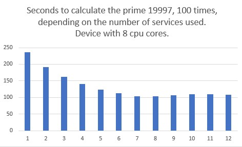

# Multi-Service Example

*Schedule tasks on multiple services.*

Background reading [Android Service](https://github.com/Android-for-Python/Android-for-Python-Users#android-service).

Start the services, start the tasks (repeat?), later stop the services. Perhaps repeat this sequence.

The number of services and the number of tasks are configured in the `build()` method. By default the app starts 6 services, and 20 tasks. The default number of services will be decreased if the device has less than 6 cores.

In this example the task (implemented in `service.py`) is to generate a bounded psudo random prime number in a somewhat inefficient way. Just busy work. When the tasks are complete the app reports a normalized measure of time taken.

Foreground services are used, these can be replaced with backdround services in `buildozer.spec`. The service has AutoRestartService(True) and the app attempts to connect to a restarted service. Reconnection may not be reliable in all cases in which case the restarted service will be unavailable.  

Performace for fine grained tasks depends on the number of services started. Starting more services than the device has cores is always counter productive. For the plot below, the example was modified to always generate the same prime number and report latency in seconds. The UI activity was minimal.

Clearly there is some overhead somewhere, as it takes adding between 4 and 5 cores to half the time taken by the tasks on 1 core.